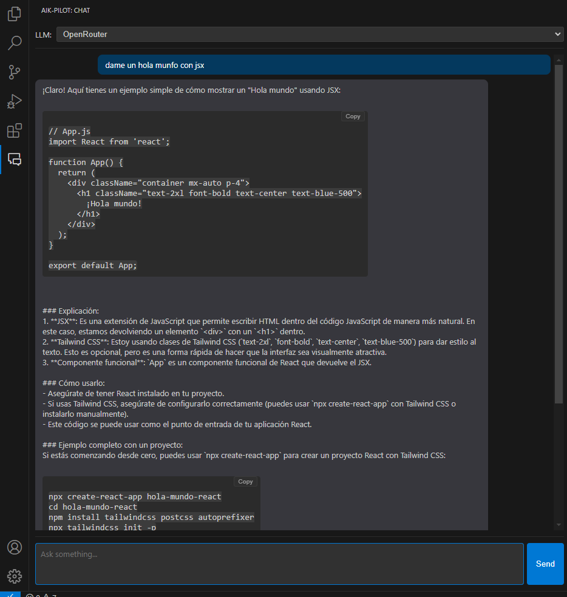

# AIK-Pilot - Asistente de Código IA Experto para VS Code

 <!-- Reemplaza con tu enlace real del marketplace -->

**AIK-Pilot** es una extensión para Visual Studio Code diseñada para ser tu compañero experto en programación, impulsado por modelos de lenguaje grandes (LLMs). Obtén ayuda con código, explicaciones, refactorizaciones y autocompletado directamente en tu editor.

 <!-- Añade una captura de pantalla si tienes -->

## ✨ Funcionalidades Principales

*   **Chat Interactivo:** Abre un panel de chat dedicado para conversar con el LLM. Haz preguntas, pide explicaciones, solicita refactorizaciones o genera código.
*   **Soporte Multi-Proveedor:** Conéctate a diferentes servicios LLM:
    *   **Ollama (Local):** Ejecuta modelos potentes directamente en tu máquina para privacidad y acceso offline.
    *   **OpenAI:** Accede a modelos como GPT-4, GPT-3.5, etc. (requiere API Key).
    *   **OpenRouter:** Utiliza una amplia gama de modelos de diferentes proveedores a través de una única API (requiere API Key).
*   **Memoria de Conversación:** El chat recuerda las últimas interacciones para mantener el contexto.
*   **Formato de Código:** Las respuestas de código en el chat se presentan en bloques formateados con un botón para copiar fácilmente.
*   **Autocompletado Inteligente (Experimental):** Obtén sugerencias de código mientras escribes, basadas en el contexto actual y potenciadas por el LLM seleccionado.
*   **System Prompt Personalizable:** Define un mensaje de sistema para guiar el comportamiento general de la IA (por ejemplo, para que solo genere código).
*   **Configuración Flexible:** Ajusta parámetros como el modelo específico, la temperatura, el máximo de tokens y habilita/deshabilita funciones a través de los ajustes de VS Code.

## 🚀 Cómo Empezar

1.  **Instalación:**
    *   Busca "AIK-Pilot" en el Marketplace de extensiones de VS Code e instálala.
    *   *O (para desarrollo):* Clona este repositorio y presiona `F5` en VS Code para iniciar una ventana de desarrollo con la extensión cargada.

2.  **Configuración Inicial (¡Importante!):**
    *   Abre los Ajustes de VS Code ( `Ctrl+,` o `Cmd+,` ).
    *   Busca `AIK-Pilot`.
    *   **Selecciona tu Proveedor Activo:** En `Aik-pilot: Active Provider`, elige entre `ollama`, `openai`, u `openrouter`.
    *   **Configura el Proveedor Seleccionado:** Expande la sección `Aik-pilot: Providers`:
        *   **Ollama:**
            *   Verifica que `endpointUrl` sea correcto (normalmente `http://localhost:11434/v1`).
            *   Asegúrate de que `modelName` coincida *exactamente* con un modelo que hayas descargado con `ollama pull ...` (ej. `llama3`, `mistral`, `codellama:7b-instruct`, `qwen2.5:7b`). Puedes verificar tus modelos locales ejecutando `ollama list` en tu terminal.
            *   `apiKey` debe dejarse vacío o como `null`.
        *   **OpenAI:**
            *   Verifica `endpointUrl` (`https://api.openai.com/v1`).
            *   Elige un `modelName` válido (ej. `gpt-4o-mini`, `gpt-3.5-turbo`).
            *   **Pega tu clave API secreta de OpenAI** en el campo `apiKey`.
        *   **OpenRouter:**
            *   Verifica `endpointUrl` (`https://openrouter.ai/api/v1`).
            *   Elige un `modelName` válido de OpenRouter (ej. `mistralai/mistral-7b-instruct`, `google/gemini-flash-1.5`).
            *   **Pega tu clave API de OpenRouter** en el campo `apiKey`.
            *   (Opcional) Puedes añadir tu URL en `customHeaders` -> `HTTP-Referer` si lo deseas.
    *   **(Opcional) Ajusta Otros Parámetros:** Modifica `systemPrompt`, `temperature`, `maxTokens`, o las opciones de autocompletado según tus preferencias.

3.  **Abre el Chat:**
    *   Haz clic en el icono de AIK-Pilot (un icono de chat) en la Barra de Actividad (Activity Bar) de VS Code.
    *   Alternativamente, abre la Paleta de Comandos (`Ctrl+Shift+P` o `Cmd+Shift+P`) y busca `AIK-Pilot: Open Chat`.

4.  **Chatea con la IA:**
    *   Escribe tus preguntas o peticiones en el área de texto inferior y presiona "Send" o Enter.
    *   El proveedor LLM seleccionado (Ollama, OpenAI, u OpenRouter) procesará tu solicitud.
    *   Las respuestas aparecerán en la lista de mensajes. Los bloques de código tendrán un botón "Copy".

5.  **Usa el Autocompletado:**
    *   Asegúrate de que `Aik-pilot: Completion: Enabled` esté marcado en los ajustes.
    *   Empieza a escribir código en un archivo compatible. La extensión intentará ofrecer sugerencias después de un breve retraso (configurable con `completion.debounceMs`) o al presionar caracteres trigger (como `.`). *Nota: Esta función es experimental y su calidad dependerá del modelo y la configuración.*

## ⚙️ Configuración Detallada

Todas las configuraciones se encuentran buscando `AIK-Pilot` en los Ajustes de VS Code:

*   **`aik-pilot.activeProvider`**: Selecciona el servicio LLM a usar (`ollama`, `openai`, `openrouter`).
*   **`aik-pilot.providers`**: Objeto para configurar los detalles de cada proveedor (ver sección "Configuración Inicial").
    *   `displayName`: Nombre mostrado (no editar).
    *   `endpointUrl`: URL base de la API del proveedor.
    *   `modelName`: Nombre/ID exacto del modelo a usar con ese proveedor.
    *   `apiKey`: Clave API (requerida para OpenAI y OpenRouter).
    *   `customHeaders`: (Opcional) Encabezados HTTP adicionales (útil para OpenRouter).
*   **`aik-pilot.systemPrompt`**: Mensaje de sistema para guiar a la IA. Déjalo vacío para deshabilitar.
*   **`aik-pilot.temperature`**: Controla la aleatoriedad de la respuesta (0 = determinista, >1 = más creativo).
*   **`aik-pilot.maxTokens`**: Límite de tokens en la respuesta generada.
*   **`aik-pilot.completion.enabled`**: Habilita o deshabilita la función de autocompletado.
*   **`aik-pilot.completion.debounceMs`**: Retraso en milisegundos antes de solicitar autocompletado después de dejar de escribir.

## ⚠️ Notas y Limitaciones

*   **API Keys:** Necesitarás tus propias claves API para usar los servicios de OpenAI y OpenRouter. Mantenlas seguras.
*   **Rendimiento Local (Ollama):** El rendimiento con Ollama depende en gran medida de tu hardware (CPU, GPU, RAM). Modelos grandes pueden ser lentos o causar timeouts en máquinas menos potentes.
*   **Autocompletado Experimental:** La calidad y velocidad del autocompletado pueden variar significativamente. Requiere un modelo rápido y bien ajustado para completion.
*   **Costos:** El uso de APIs como OpenAI u OpenRouter puede incurrir en costos basados en el uso de tokens. Monitoriza tu consumo.
*   **Errores:** Si encuentras errores, revisa el panel de "Output" de VS Code (seleccionando el canal "AIK-Pilot" o similar en el desplegable) para obtener logs detallados.

## 🤝 Contribuciones

¡Las contribuciones son bienvenidas! Si encuentras bugs o tienes ideas para mejoras, por favor abre un issue o un pull request en el repositorio de GitHub (enlace al repositorio si es público).

## 📄 Licencia

[MIT](./LICENSE) <!-- Asume licencia MIT, crea un archivo LICENSE si no lo tienes -->

---

*¡Esperamos que AIK-Pilot te ayude a programar de forma más eficiente y creativa!*